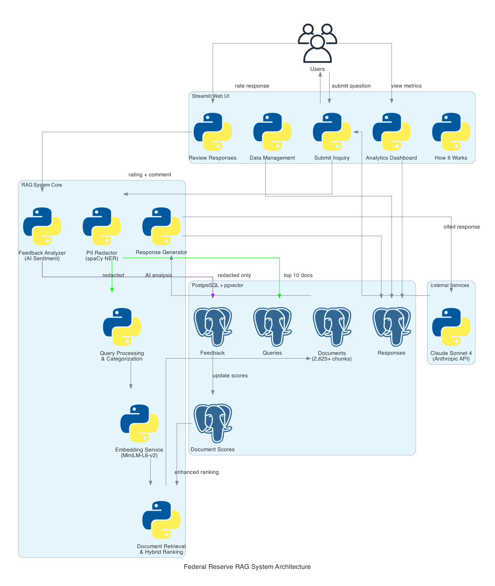
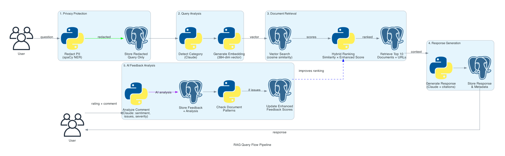
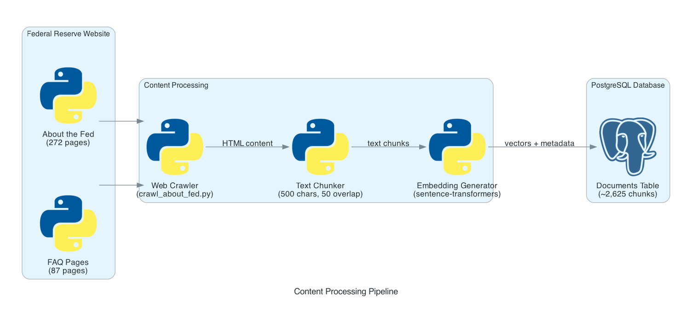

# Pipeline Architecture Documentation

This document provides a comprehensive overview of the Federal Reserve RAG system architecture, including detailed explanations of all data flows, components, and processing pipelines.

## Table of Contents

1. [System Overview](#system-overview)
2. [Architecture Diagram](#architecture-diagram)
3. [Query Processing Pipeline](#query-processing-pipeline)
4. [Content Processing Pipeline](#content-processing-pipeline)
5. [Component Details](#component-details)
6. [Data Flow Examples](#data-flow-examples)
7. [Performance Considerations](#performance-considerations)

---

## System Overview

The Federal Reserve RAG system is built on a **Retrieval Augmented Generation (RAG)** architecture that combines:

- **Vector similarity search** for finding relevant documents
- **Large Language Models (LLMs)** for generating professional responses
- **Privacy-first design** with local PII redaction
- **AI-powered feedback analysis** for continuous improvement

### High-Level Architecture

```
┌─────────────────┐
│   User Query    │
└────────┬────────┘
         │
         ▼
┌─────────────────────────────────────────────────┐
│            PII Redaction (spaCy)                │
│  • Emails, phones, SSNs, names, locations       │
│  • Local processing - never sent to API         │
└────────┬────────────────────────────────────────┘
         │
         ▼
┌─────────────────────────────────────────────────┐
│         Vector Similarity Search                │
│  • Embed query (384-dim MiniLM-L6-v2)          │
│  • Search documents (PostgreSQL + pgvector)     │
│  • Hybrid ranking (similarity + feedback)       │
└────────┬────────────────────────────────────────┘
         │
         ▼
┌─────────────────────────────────────────────────┐
│      Response Generation (Claude/Local)         │
│  • Context from top-10 documents                │
│  • Professional correspondence style            │
│  • Inline citations [Source N]                  │
└────────┬────────────────────────────────────────┘
         │
         ▼
┌─────────────────────────────────────────────────┐
│           User Feedback Loop                    │
│  • Star rating (1-5)                            │
│  • Optional comment                             │
│  • AI sentiment analysis (Claude/Local)         │
│  • Enhanced feedback score calculation          │
└─────────────────────────────────────────────────┘
```

---

## Architecture Diagram



### Component Breakdown

#### 1. **User Interface Layer** (Streamlit)
- **File:** `streamlit_app.py`
- **Purpose:** Web-based UI for queries, responses, feedback, and analytics
- **Pages:**
  - Ask a Question (main query interface)
  - View Responses (history with search/filter)
  - Analytics Dashboard (metrics and visualizations)
  - Document Management (view and flag documents)
  - Feedback Management (review user comments)
  - How It Works (system documentation)

#### 2. **Application Layer**
- **RAG System** (`rag_system.py`)
  - Query processing
  - Document retrieval
  - Response generation
  - Category detection

- **PII Redactor** (`pii_redactor.py`)
  - Pattern-based detection (regex)
  - Named Entity Recognition (spaCy)
  - Context-aware filtering
  - Privacy guarantees

- **Feedback Analyzer** (`feedback_analyzer.py`)
  - Sentiment extraction
  - Issue identification
  - Severity assessment
  - Enhanced scoring

#### 3. **Data Layer**
- **PostgreSQL Database** (`database.py`)
  - Documents with vector embeddings
  - Query history (redacted only)
  - Response storage
  - Feedback and ratings
  - Source tracking
  - Analytics aggregations

- **Vector Search** (pgvector extension)
  - 384-dimensional embeddings
  - Cosine similarity search
  - IVFFlat index for performance
  - Hybrid ranking algorithm

#### 4. **External Services**
- **Claude Sonnet 4 API** (or local models)
  - Response generation
  - Category detection
  - Sentiment analysis

- **Federal Reserve Website**
  - Content source (federalreserve.gov)
  - Crawled via `crawl_about_fed.py`
  - Imported via `fed_content_importer.py`

---

## Query Processing Pipeline



This diagram shows the complete 15-step flow from user query to stored response with feedback.

### Step-by-Step Breakdown

#### **Steps 1-4: Query Submission & PII Protection**

```
User submits: "My name is John Smith and I live in Boston. What's the fed rate?"
         ↓
PII Detection (spaCy NER):
  - Detects: "John Smith" (PERSON), "Boston" (GPE)
  - Excludes: "fed" (Federal Reserve term)
         ↓
Redacted query: "My name is [REDACTED_NAME] and I live in [REDACTED_LOCATION]. What's the fed rate?"
         ↓
Store in database: query_text = redacted version ONLY
                   has_pii = TRUE
                   redaction_count = 2
```

**Files involved:**
- `pii_redactor.py:69-165` - `redact()` method
- `database.py` - `store_query()` method

**Key privacy guarantee:** Original query with PII is **NEVER** stored in the database.

---

#### **Steps 5-7: Vector Search & Ranking**

```
Redacted query → Vector Embedding
         ↓
[0.234, -0.891, 0.445, ...] (384 dimensions)
         ↓
PostgreSQL pgvector search:
  SELECT *,
         (embedding <=> query_vector) AS similarity
  FROM documents
  ORDER BY similarity
  LIMIT 100
         ↓
Hybrid Ranking Formula:
  Final Score = Similarity × (Base Score × (1 + 0.3 × Enhanced Feedback Score))

  Where:
  - Similarity: 0.0-1.0 from vector search
  - Base Score: (avg_rating - 3.0) / 2.0
  - Enhanced Feedback Score: Combines rating + sentiment + penalties
         ↓
Top 10 documents selected
```

**Files involved:**
- `embeddings.py:27-41` - `get_embedding()` method
- `database.py` - `search_documents()` method
- `rag_system.py:98-164` - `retrieve_documents()` method

**SQL Query:**
```sql
WITH feedback_scores AS (
  SELECT
    document_id,
    AVG(rating) as avg_rating,
    AVG(COALESCE(enhanced_feedback_score, 0)) as avg_enhanced_score
  FROM feedback
  GROUP BY document_id
)
SELECT
  d.*,
  (d.embedding <=> %s::vector) AS similarity,
  COALESCE(fs.avg_rating, 3.0) as avg_rating,
  COALESCE(fs.avg_enhanced_score, 0.0) as enhanced_score,
  (1 - (d.embedding <=> %s::vector)) *
  (((COALESCE(fs.avg_rating, 3.0) - 3.0) / 2.0) *
   (1 + 0.3 * COALESCE(fs.avg_enhanced_score, 0.0))) as final_score
FROM documents d
LEFT JOIN feedback_scores fs ON d.id = fs.document_id
WHERE d.is_flagged = FALSE
ORDER BY final_score DESC
LIMIT 10;
```

---

#### **Steps 8-10: Response Generation**

```
Top 10 documents → Context Assembly
         ↓
Prompt Construction:
  System: "You are a professional Federal Reserve correspondence writer..."
  Context: "Source 1 (faq): [url]\n[content]\n\nSource 2 (press_release): ..."
  Query: "[Redacted query]"
         ↓
Claude API Call (or local model):
  - Model: claude-sonnet-4-20250514
  - Max tokens: 2000
  - Temperature: 0.7
         ↓
Generated Response:
  "The federal funds rate is the target interest rate set by the
   Federal Open Market Committee [Source 1]. As of [date], the
   target range is X.XX% to Y.YY% [Source 2]..."
         ↓
Store in database:
  - response_text
  - response_category (from AI detection)
  - document_ids (sources used)
  - created_at timestamp
```

**Files involved:**
- `rag_system.py:166-246` - `generate_response()` method
- `rag_system.py:248-288` - `detect_query_category()` method

**Prompt Template:**
```python
system_prompt = """You are a professional correspondence writer for the Federal Reserve Board of Governors.

Your task is to provide accurate, well-cited responses to questions about Federal Reserve policies, operations, and monetary policy based on official Federal Reserve documentation.

IMPORTANT GUIDELINES:
1. Base your response ONLY on the provided source documents
2. Include inline citations in the format [Source N] after each fact or claim
3. Write in a professional, formal tone suitable for official correspondence
4. If the answer cannot be determined from the sources, clearly state this
5. Structure your response with clear paragraphs
6. Do not include personal opinions or speculation
7. Focus on accuracy and clarity"""

user_prompt = f"""Based on the following Federal Reserve documents, please answer the question below.

SOURCES:
{context_text}

QUESTION:
{query}

Please provide a professional response with inline citations."""
```

---

#### **Steps 11-15: User Feedback & Analysis**

```
User rates response: 4 stars
User comment: "Good info but could be more current"
         ↓
AI Sentiment Analysis (Claude/Local):
  Input: rating=4, comment="Good info but could be more current"
         ↓
  Extract structured data:
  {
    "sentiment": "positive",
    "confidence": 0.75,
    "issues": ["outdated_info"],
    "severity": "minor",
    "summary": "User appreciates response but notes information may be outdated"
  }
         ↓
Calculate Enhanced Feedback Score:
  Base Score = (4 - 3.0) / 2.0 = 0.5
  Sentiment Contribution = 0.75 × 0.3 = 0.225
  Issue Penalty = -0.15 (outdated_info)

  Enhanced Score = (0.7 × 0.5) + (0.3 × 0.225) + (-0.15)
                 = 0.35 + 0.0675 - 0.15
                 = 0.2675
         ↓
Store feedback in database:
  - query_id, rating, comment
  - sentiment, confidence, issues, severity
  - enhanced_feedback_score
         ↓
Check document patterns:
  If document has 3+ "outdated_info" issues → flag for review
```

**Files involved:**
- `feedback_analyzer.py:56-142` - `analyze_comment()` method
- `feedback_analyzer.py:144-167` - `calculate_enhanced_score()` method
- `database.py` - `store_feedback()` method

**Enhanced Scoring Formula:**
```python
def calculate_enhanced_score(rating: int, analysis: Dict) -> float:
    # Base score from rating (normalized to -1.0 to 1.0)
    base_score = (rating - 3.0) / 2.0

    # Sentiment contribution (weighted at 30%)
    sentiment_score = analysis.get('confidence', 0.5)
    if analysis.get('sentiment') == 'negative':
        sentiment_score *= -1
    elif analysis.get('sentiment') == 'neutral':
        sentiment_score *= 0

    # Severity penalty
    severity_penalty = {
        'severe': -0.3,
        'moderate': -0.15,
        'minor': -0.05
    }.get(analysis.get('severity'), 0)

    # Issue-specific penalties
    issue_penalties = {
        'incorrect_info': -0.20,
        'outdated_info': -0.15,
        'missing_citations': -0.08,
        'too_technical': -0.10,
        'irrelevant': -0.12,
        'unclear': -0.08
    }

    total_issue_penalty = sum(
        issue_penalties.get(issue, 0)
        for issue in analysis.get('issues', [])
    )

    # Combine: 70% rating + 30% sentiment + penalties
    enhanced_score = (
        (0.7 * base_score) +
        (0.3 * sentiment_score) +
        severity_penalty +
        total_issue_penalty
    )

    # Clamp to [-1.0, 1.0]
    return max(-1.0, min(1.0, enhanced_score))
```

---

## Content Processing Pipeline



This diagram shows how Federal Reserve content is crawled, processed, and stored in the database.

### Pipeline Stages

#### **Stage 1: Web Crawling**

```
Federal Reserve Website (federalreserve.gov)
         ↓
crawl_about_fed.py:
  - Fetches "About the Fed" pages
  - Fetches FAQ pages
  - Follows links recursively
  - Extracts clean text content
  - Saves to local files
         ↓
Local Storage:
  about_the_fed_pages/*.txt
  faq_pages/*.txt
```

**Implementation:**
```python
# crawl_about_fed.py
def crawl_page(url: str) -> Dict:
    response = requests.get(url)
    soup = BeautifulSoup(response.content, 'html.parser')

    # Extract main content
    main_content = soup.find('div', class_='main-content')

    # Clean text
    text = main_content.get_text(separator='\n', strip=True)

    return {
        'url': url,
        'title': soup.find('title').text,
        'content': text,
        'fetched_date': datetime.now().isoformat()
    }
```

**Files involved:**
- `crawl_about_fed.py` - Web crawler
- `about_the_fed_pages/` - Cached content (gitignored)
- `faq_pages/` - Cached FAQ content (gitignored)

---

#### **Stage 2: Content Import & Processing**

```
Local text files
         ↓
fed_content_importer.py:
  - Reads text files
  - Chunks large documents (max 2000 chars)
  - Generates embeddings
  - Stores in database
         ↓
For each document:
  1. Clean and normalize text
  2. Extract metadata (URL, title, source_type)
  3. Generate 384-dim embedding via MiniLM-L6-v2
  4. Insert into documents table
```

**Implementation:**
```python
# fed_content_importer.py
def import_document(file_path: str, source_type: str):
    with open(file_path, 'r') as f:
        content = f.read()

    # Chunk if too large
    if len(content) > 2000:
        chunks = chunk_text(content, max_length=2000)
    else:
        chunks = [content]

    for i, chunk in enumerate(chunks):
        # Generate embedding
        embedding = embeddings_service.get_embedding(chunk)

        # Store in database
        db.insert_document(
            content=chunk,
            url=extract_url(file_path),
            source_type=source_type,
            embedding=embedding,
            chunk_index=i if len(chunks) > 1 else None
        )
```

**Files involved:**
- `fed_content_importer.py` - Import orchestration
- `embeddings.py` - Embedding generation
- `database.py` - Database storage

---

#### **Stage 3: Vector Indexing**

```
Documents in PostgreSQL
         ↓
pgvector extension:
  - Creates vector column (384 dimensions)
  - Builds IVFFlat index
  - Optimizes for cosine similarity search
         ↓
Index ready for queries
```

**SQL Schema:**
```sql
CREATE TABLE documents (
    id SERIAL PRIMARY KEY,
    content TEXT NOT NULL,
    embedding vector(384),  -- pgvector type
    url TEXT,
    source_type VARCHAR(50),
    title TEXT,
    fetched_date TIMESTAMP,
    chunk_index INTEGER,
    created_at TIMESTAMP DEFAULT NOW()
);

-- Vector similarity index
CREATE INDEX idx_documents_embedding
ON documents
USING ivfflat (embedding vector_cosine_ops)
WITH (lists = 100);
```

**Files involved:**
- `schema.sql` - Database schema
- PostgreSQL with pgvector extension

---

## Component Details

### 1. PII Redaction System

**Purpose:** Protect user privacy by removing PII before processing or storage.

**Architecture:**
```
User Query
    ↓
┌─────────────────────────────────────┐
│  Pattern-Based Detection (Regex)   │
│  • Emails                           │
│  • Phone numbers                    │
│  • SSNs                             │
│  • Credit cards                     │
│  • IP addresses                     │
│  • Account numbers                  │
└──────────────┬──────────────────────┘
               ↓
┌─────────────────────────────────────┐
│  NER-Based Detection (spaCy)        │
│  • Person names (PERSON)            │
│  • Organizations (ORG)              │
│  • Locations (GPE, LOC, FAC)        │
│  • Dates (DATE)                     │
└──────────────┬──────────────────────┘
               ↓
┌─────────────────────────────────────┐
│  Context-Aware Filtering            │
│  • Preserve Federal Reserve terms   │
│  • Preserve financial terminology   │
│  • Preserve month names             │
└──────────────┬──────────────────────┘
               ↓
         Redacted Query
```

**Example:**
```
Input:  "My name is John Smith, SSN 123-45-6789, and I live in Boston.
         Contact me at john@email.com. What does the Federal Reserve Bank
         of New York say about interest rates?"

Output: "My name is [REDACTED_NAME], [REDACTED_SSN], and I live in
         [REDACTED_LOCATION]. Contact me at [REDACTED_EMAIL]. What does
         the Federal Reserve Bank of New York say about interest rates?"

Preserved: "Federal Reserve Bank of New York" (whitelist)
Redacted: Names, SSN, email, location
```

**Files:** `pii_redactor.py`, `PII_REDACTION.md`

---

### 2. Vector Similarity Search

**Purpose:** Find relevant documents using semantic similarity.

**How it works:**

1. **Query Embedding:**
   ```python
   query = "What is quantitative easing?"
   query_vector = model.encode(query)  # [0.123, -0.456, 0.789, ...]
   ```

2. **Similarity Calculation:**
   ```
   Cosine Similarity = (A · B) / (||A|| × ||B||)

   Where:
   A = query_vector
   B = document_embedding

   Result: 0.0 (completely different) to 1.0 (identical)
   ```

3. **Efficient Search:**
   ```sql
   -- pgvector uses IVFFlat (Inverted File with Flat compression)
   -- Approximates nearest neighbors for speed

   SELECT *, (embedding <=> query_vector) AS distance
   FROM documents
   ORDER BY distance
   LIMIT 10;
   ```

**Performance:**
- Without index: O(n) - checks every document
- With IVFFlat index: O(log n) - approximates nearest neighbors
- 10,000 documents: <100ms query time

**Files:** `embeddings.py`, `database.py`

---

### 3. Hybrid Ranking Algorithm

**Purpose:** Combine vector similarity with user feedback for better results.

**Formula:**
```
Final Score = Similarity × (Base Score × (1 + Boost))

Where:
  Similarity = 1 - cosine_distance  (0.0 to 1.0)
  Base Score = (avg_rating - 3.0) / 2.0  (-1.0 to 1.0)
  Boost = 0.3 × Enhanced Feedback Score  (up to ±0.3)
  Enhanced Feedback Score = combines rating + sentiment + penalties
```

**Example Calculation:**

Document A:
- Similarity: 0.85
- Average rating: 4.5
- Enhanced feedback score: 0.6

```
Base Score = (4.5 - 3.0) / 2.0 = 0.75
Boost = 0.3 × 0.6 = 0.18
Final Score = 0.85 × (0.75 × (1 + 0.18))
            = 0.85 × (0.75 × 1.18)
            = 0.85 × 0.885
            = 0.752
```

Document B:
- Similarity: 0.90 (higher similarity)
- Average rating: 2.5
- Enhanced feedback score: -0.5

```
Base Score = (2.5 - 3.0) / 2.0 = -0.25
Boost = 0.3 × (-0.5) = -0.15
Final Score = 0.90 × (-0.25 × (1 + (-0.15)))
            = 0.90 × (-0.25 × 0.85)
            = 0.90 × (-0.2125)
            = -0.191
```

**Result:** Document A ranks higher despite lower similarity because of better feedback.

**Files:** `rag_system.py:98-164`

---

### 4. AI-Powered Feedback Analysis

**Purpose:** Extract structured insights from user comments.

**Process:**

```
User feedback: rating=3, comment="Response was unclear and too technical"
    ↓
Claude API (or local model):
    System: "You are a feedback analysis AI..."
    Prompt: "Analyze this feedback and extract structured data..."
    ↓
AI Response (JSON):
{
  "sentiment": "negative",
  "confidence": 0.85,
  "issues": ["unclear", "too_technical"],
  "severity": "moderate",
  "summary": "User found response confusing and overly complex"
}
    ↓
Calculate enhanced score:
  Base: (3 - 3.0) / 2.0 = 0.0
  Sentiment: -0.85 (negative with high confidence)
  Penalties: -0.08 (unclear) + -0.10 (too_technical) = -0.18

  Enhanced = (0.7 × 0.0) + (0.3 × -0.85) + (-0.18)
           = 0.0 - 0.255 - 0.18
           = -0.435
    ↓
Store in database with structured metadata
```

**Benefits:**
1. Identifies specific problems (not just low ratings)
2. Detects patterns across documents
3. Enables automatic quality flagging
4. Provides actionable insights for improvement

**Files:** `feedback_analyzer.py`, `FEEDBACK_ANALYSIS.md`

---

## Data Flow Examples

### Example 1: New User Query

**Input:**
```
User: "What is the Federal Reserve's inflation target?"
```

**Flow:**

1. **PII Check** → No PII detected → Query unchanged

2. **Embedding:**
   ```
   Vector: [0.234, -0.891, 0.445, ..., 0.123] (384 dims)
   ```

3. **Vector Search:** Top 10 documents found
   ```
   Doc 1: "...inflation target of 2 percent..." (similarity: 0.92)
   Doc 2: "...FOMC aims for 2% inflation..." (similarity: 0.88)
   Doc 3: "...measured by PCE index..." (similarity: 0.85)
   ...
   ```

4. **Category Detection:** "Monetary Policy"

5. **Response Generation:**
   ```
   "The Federal Reserve's inflation target is 2 percent over the
    longer run, as measured by the annual change in the Personal
    Consumption Expenditures (PCE) price index [Source 1]. The
    Federal Open Market Committee (FOMC) established this target
    to promote price stability [Source 2]..."
   ```

6. **Storage:**
   ```sql
   INSERT INTO queries (query_text, category, has_pii)
   VALUES ('What is the Federal Reserve's inflation target?',
           'Monetary Policy', FALSE);

   INSERT INTO responses (query_id, response_text, document_ids)
   VALUES (123, '[response text]', '{45, 67, 89, ...}');
   ```

---

### Example 2: Query with PII

**Input:**
```
User: "I'm Jane Doe from Chicago. Can you explain quantitative easing?"
```

**Flow:**

1. **PII Detection:**
   ```
   Detected:
   - "Jane Doe" → PERSON
   - "Chicago" → GPE (Geopolitical Entity)

   Redacted:
   "I'm [REDACTED_NAME] from [REDACTED_LOCATION]. Can you explain quantitative easing?"
   ```

2. **Database Storage:**
   ```sql
   INSERT INTO queries (
     query_text,  -- Redacted version ONLY
     has_pii,
     redaction_count,
     redaction_details
   ) VALUES (
     'I''m [REDACTED_NAME] from [REDACTED_LOCATION]. Can you explain quantitative easing?',
     TRUE,
     2,
     '[{"type": "named_entity_PERSON", ...}, {"type": "named_entity_GPE", ...}]'
   );
   ```
   **Note:** Original query "I'm Jane Doe from Chicago..." is NEVER stored.

3. **Processing:** Continue with redacted version
   - Embedding generated from redacted text
   - Claude receives redacted version
   - Response generated

4. **User Display:**
   ```
   Warning: "🔒 Privacy Protection: Redacted: 1 Location, 1 Person"
   Redacted query shown in info box
   Response provided
   ```

---

### Example 3: Feedback Processing

**Input:**
```
User rates response: 5 stars
Comment: "Perfect answer with great citations!"
```

**Flow:**

1. **AI Analysis:**
   ```json
   {
     "sentiment": "positive",
     "confidence": 0.95,
     "issues": [],
     "severity": "minor",
     "summary": "User very satisfied with answer quality and citation format"
   }
   ```

2. **Score Calculation:**
   ```
   Base Score = (5 - 3.0) / 2.0 = 1.0
   Sentiment = +0.95 (positive, high confidence)
   Issues = none

   Enhanced = (0.7 × 1.0) + (0.3 × 0.95) + 0
            = 0.7 + 0.285
            = 0.985
   ```

3. **Database Update:**
   ```sql
   INSERT INTO feedback (
     query_id, rating, comment,
     sentiment, confidence, issues, severity,
     enhanced_feedback_score
   ) VALUES (
     123, 5, 'Perfect answer with great citations!',
     'positive', 0.95, '[]', 'minor',
     0.985
   );
   ```

4. **Impact on Rankings:**
   - Documents used in this response get higher scores
   - Future queries will rank these documents higher
   - Continuous improvement loop

---

## Performance Considerations

### Database Query Optimization

**Indexes:**
```sql
-- Vector similarity (IVFFlat)
CREATE INDEX idx_documents_embedding
ON documents USING ivfflat (embedding vector_cosine_ops);

-- Query lookups
CREATE INDEX idx_queries_created_at ON queries(created_at);
CREATE INDEX idx_queries_category ON queries(category);

-- Feedback aggregation
CREATE INDEX idx_feedback_document_id ON feedback(document_id);
CREATE INDEX idx_feedback_query_id ON feedback(query_id);
```

**Materialized Views for Analytics:**
```sql
CREATE MATERIALIZED VIEW query_category_stats AS
SELECT
  category,
  COUNT(*) as total_queries,
  AVG(CASE WHEN r.id IS NOT NULL THEN 1 ELSE 0 END) as response_rate
FROM queries q
LEFT JOIN responses r ON q.id = r.query_id
GROUP BY category;

-- Refresh periodically
REFRESH MATERIALIZED VIEW query_category_stats;
```

### Embedding Performance

**Caching:**
```python
from functools import lru_cache

@lru_cache(maxsize=1000)
def get_embedding_cached(text: str) -> List[float]:
    return model.encode(text).tolist()
```

**Batch Processing:**
```python
# Process multiple documents at once
embeddings = model.encode([doc1, doc2, doc3, ...], batch_size=32)
```

### Response Generation

**Streaming (for large responses):**
```python
# Stream tokens as they're generated
for chunk in client.chat.completions.create(
    model="claude-sonnet-4",
    messages=[...],
    stream=True
):
    yield chunk.choices[0].delta.content
```

**Timeout Handling:**
```python
from timeout_decorator import timeout

@timeout(30)  # 30 second timeout
def generate_response(query, context):
    # Generate response
    pass
```

### Scaling Considerations

**For 1,000+ queries/day:**
- Add read replicas for analytics queries
- Use connection pooling
- Cache common queries
- Implement rate limiting

**For 10,000+ documents:**
- Increase IVFFlat lists: `WITH (lists = 500)`
- Use more powerful embedding model
- Implement document deduplication
- Add document expiration/archiving

**For high availability:**
- Deploy PostgreSQL with replication
- Use managed database service (RDS, Cloud SQL)
- Add application load balancer
- Implement health checks and monitoring

---

## Diagram Generation

All diagrams are generated using the `diagrams` Python library.

**To regenerate diagrams:**
```bash
python3 generate_pipeline_diagram.py
```

**Files generated:**
- `rag_architecture.png` - System architecture (1200x800)
- `rag_query_flow.png` - 15-step query pipeline (1400x1200)
- `rag_content_pipeline.png` - Content processing (1200x600)

**Customization:**

Edit `generate_pipeline_diagram.py` to:
- Change diagram layout
- Add/remove components
- Update labels and descriptions
- Modify colors and styling

**Requirements:**
```bash
# Install Graphviz (system dependency)
brew install graphviz  # macOS
# or
sudo apt-get install graphviz  # Linux

# Install Python library
pip install diagrams
```

---

## File Reference

Quick reference to key files for each component:

| Component | Primary Files | Purpose |
|-----------|---------------|---------|
| **PII Redaction** | `pii_redactor.py` | Detect and redact PII locally |
| **Vector Search** | `embeddings.py`, `database.py` | Generate embeddings, search documents |
| **RAG Core** | `rag_system.py` | Orchestrate query processing |
| **Response Gen** | `rag_system.py:166-246` | Generate professional responses |
| **Feedback Analysis** | `feedback_analyzer.py` | AI-powered comment analysis |
| **Database** | `database.py`, `schema*.sql` | Data persistence and retrieval |
| **Web UI** | `streamlit_app.py` | User interface |
| **Content Import** | `fed_content_importer.py`, `crawl_about_fed.py` | Ingest Federal Reserve content |
| **Diagrams** | `generate_pipeline_diagram.py` | Generate architecture diagrams |

---

## Additional Resources

- **[README.md](README.md)** - Main documentation and installation
- **[DEPLOYMENT.md](DEPLOYMENT.md)** - Production deployment guide
- **[LOCAL_MODEL_MIGRATION.md](LOCAL_MODEL_MIGRATION.md)** - Replace Claude with local models
- **[PII_REDACTION.md](PII_REDACTION.md)** - Privacy protection details
- **[FEEDBACK_ANALYSIS.md](FEEDBACK_ANALYSIS.md)** - AI feedback system

---

## Troubleshooting Common Pipeline Issues

### Vector Search Returns No Results

**Cause:** Embedding dimension mismatch or index not created

**Solution:**
```sql
-- Check embedding dimensions
SELECT pg_typeof(embedding),
       vector_dims(embedding)
FROM documents
LIMIT 1;

-- Rebuild index if needed
DROP INDEX idx_documents_embedding;
CREATE INDEX idx_documents_embedding
ON documents USING ivfflat (embedding vector_cosine_ops);
```

### Slow Query Performance

**Cause:** Missing indexes or too many documents

**Solution:**
```sql
-- Analyze query performance
EXPLAIN ANALYZE
SELECT * FROM documents
WHERE embedding <=> '[0.1, 0.2, ...]'::vector
ORDER BY embedding <=> '[0.1, 0.2, ...]'::vector
LIMIT 10;

-- Add/optimize indexes
CREATE INDEX CONCURRENTLY idx_name ON table(column);
```

### PII Not Being Redacted

**Cause:** spaCy model not installed or whitelist too broad

**Solution:**
```bash
# Reinstall spaCy model
python3 -m spacy download en_core_web_sm --force

# Test redaction
python3 pii_redactor.py
```

### Feedback Analysis Failing

**Cause:** JSON parsing errors from LLM

**Solution:**
- Check error handling in `feedback_analyzer.py:122-142`
- Use more structured prompts
- Add response format constraints
- Fallback to safe defaults (already implemented)

---

**Last Updated:** 2025-11-17
**Version:** 1.0
**Diagrams Generated:** `python3 generate_pipeline_diagram.py`
